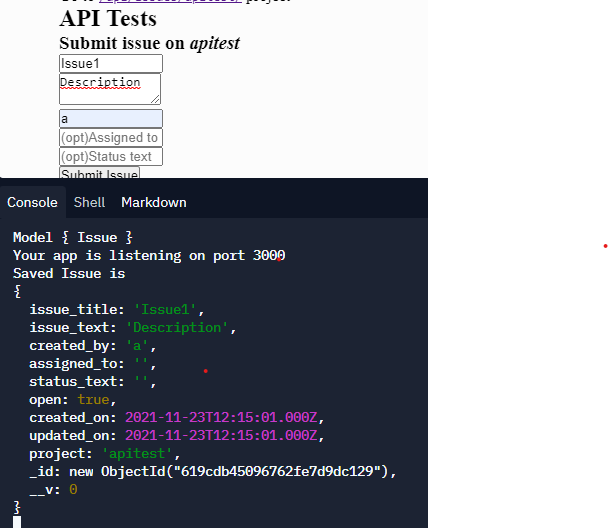

# [Issue Tracker](https://www.freecodecamp.org/learn/quality-assurance/quality-assurance-projects/issue-tracker)

### Requirement
<code>npm install mongodb@latest</code>  
<code>npm install mongoose@latest</code>

### GET

### POST
The post function() should return an object with the required fields

### PUT 

### DELETE

## [ Demo](https://boilerplate-project-metricimpconverter.sukainaabkari.repl.co/)
