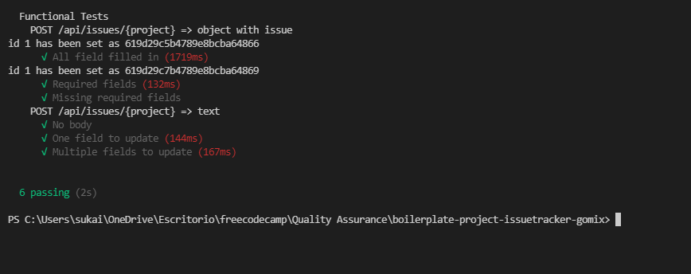

# [Issue Tracker](https://www.freecodecamp.org/learn/quality-assurance/quality-assurance-projects/issue-tracker)

## User stoies
You can provide your own project, not the example URL.

Passed
You can send a POST request to /api/issues/{projectname} with form data containing the required fields issue_title, issue_text, created_by, and optionally assigned_to and status_text.

1. The POST request to /api/issues/{projectname} will return the created object, and must include all of the submitted fields. Excluded optional fields will be returned as empty strings. Additionally, include created_on (date/time), updated_on (date/time), open (boolean, true for open - default value, false for closed), and _id. (V)

2. If you send a POST request to /api/issues/{projectname} without the required fields, returned will be the error { error: 'required field(s) missing' } (V)

3. You can send a GET request to /api/issues/{projectname} for an array of all issues for that specific projectname, with all the fields present for each issue. (F)

4. You can send a GET request to /api/issues/{projectname} and filter the request by also passing along any field and value as a URL query (ie. /api/issues/{project}?open=false). You can pass one or more field/value pairs at once. (F)

5. You can send a PUT request to /api/issues/{projectname} with an _id and one or more fields to update. On success, the updated_on field should be updated, and returned should be {  result: 'successfully updated', '_id': _id }. (F)

6. When the PUT request sent to /api/issues/{projectname} does not include an _id, the return value is { error: 'missing _id' }. (F)

7. When the PUT request sent to /api/issues/{projectname} does not include update fields, the return value is { error: 'no update field(s) sent', '_id': _id }. On any other error, the return value is { error: 'could not update', '_id': _id }. (F)

8. You can send a DELETE request to /api/issues/{projectname} with an _id to delete an issue. If no _id is sent, the return value is { error: 'missing _id' }. On success, the return value is { result: 'successfully deleted', '_id': _id }. On failure, the return value is { error: 'could not delete', '_id': _id }. (F)

All 14 functional tests are complete and passing. (F)

### Requirement
<code>npm install mongodb@latest</code>  
<code>npm install mongoose@latest</code>

### GET

### POST
The post function() should return an object with the required fields

### PUT 

### DELETE

## Tests 
1. Create an issue with every field: POST request to /api/issues/{project}
2. Create an issue with only required fields: POST request to /api/issues/{project}
3. Create an issue with missing required fields: POST request to /api/issues/{project}
4. View issues on a project: GET request to /api/issues/{project}
5. View issues on a project with one filter: GET request to /api/issues/{project}
6. View issues on a project with multiple filters: GET request to /api/issues/{project}
7. Update one field on an issue: PUT request to /api/issues/{project}
8. Update multiple fields on an issue: PUT request to /api/issues/{project}
9. Update an issue with missing _id: PUT request to /api/issues/{project}
10. Update an issue with no fields to update: PUT request to /api/issues/{project}
11. Update an issue with an invalid _id: PUT request to /api/issues/{project}
12. Delete an issue: DELETE request to /api/issues/{project}
13. Delete an issue with an invalid _id: DELETE request to /api/issues/{project}
14. Delete an issue with missing _id: DELETE request to /api/issues/{project}

### Test example

## [ Demo](https://boilerplate-project-issuetracker.sukainaabkari.repl.co)
